  

---

# 💫 About Me

👩🏻‍🎓 **Computer Science Student** at Sunway University, Malaysia    
🌱 **Currently exploring:** Data Science, Cloud Computing & Full Stack Development     
💡 **Passionate about:** Problem-solving, Innovation, and Continuous Learning    
👨🏻‍💻 **Always Learning, Always Exploring** 

<!--🎯 **Goal:** Contributing to meaningful tech solutions that impact lives  
📫 **Let's connect:** Always open to collaboration and new opportunities!-->  

 

---

# 🛠️ Tech Stack

### 💻 Programming Languages

### 🗄️ Databases & Cloud

### 🔧 Tools & Frameworks  

### 📊 Data Science & Analytics

### 🎨 Design & Other Tools

---

# 📊 GitHub Analytics

---

<!--## 🏆 GitHub Achievements

  

---

## 🎯 Current Focus

```mermaid
mindmap
  root((EWEII's Journey))
    🎓 Academic
      Computer Science
      Data Structures & Algorithms
      Software Engineering
    💼 Professional
      Full Stack Development
      Cloud Architecture
      DevOps Practices
    🚀 Personal Projects
      Open Source Contributions
      Web Applications
      Data Analysis Tools
    🌱 Learning
      Machine Learning
      System Design
      Advanced Python
```

---
-->

# 📈 Coding Activity

  

<!--## 🌟 Fun Facts & Interests

| 🎮 **When I'm not coding...** | 🌍 **Exploring...** |
|:---:|:---:|
|  |  |
| Gaming & Tech Reviews | New Technologies & Trends |

-->

<!--## 🤝 Let's Connect!

  
  
  

-->

---

  <!--
  
  -->
  
  **✨ "Code is like humor. When you have to explain it, it's bad." - Cory House ✨**
  
  

